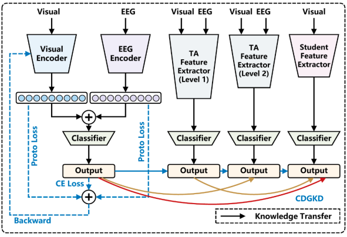

# CDGKD
A Cross-Modal Densely Guided Knowledge Distillation Based on Modality Rebalancing Strategy for Enhanced Unimodal Emotion Recognition

Accepted by IJCAI 2025
[[Paper]](https://www.ijcai.org/proceedings/2025/5217.pdf)
[[Webpage]]()



# Datasets

We evaluate our model on the DEAP and MAHNOB-HCI datasets. Both are open-access databases containing laboratory-based physiological recordings, including EEG signals and facial videos. Information on how to obtain it can be found in [DEAP](https://www.eecs.qmul.ac.uk/mmv/datasets/deap/) and [MAHNOB-HCI](https://mahnob-db.eu/hci-tagging/) specifically.


# Requirements

- TensorFlow 2.5.0
- Python 3.8

# Webpage
The webpage is shown in [Here]().


# Reference

```

```